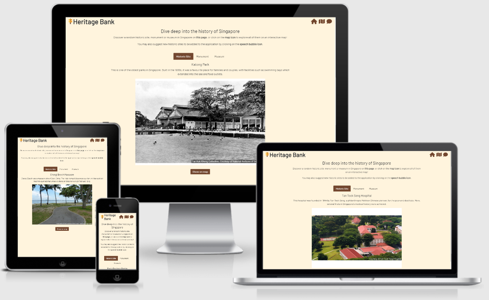
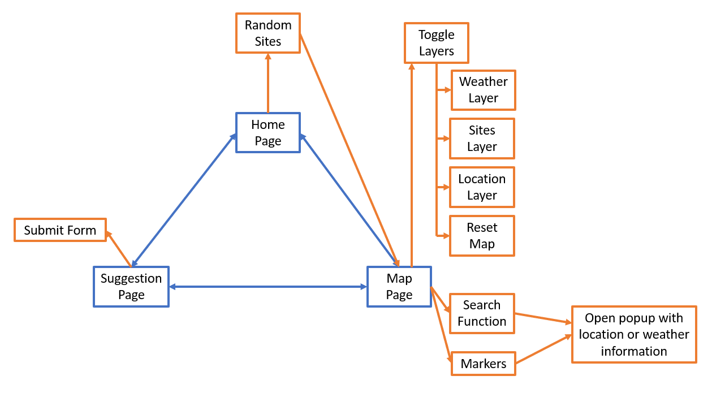

# Heritage Bank

<br>

The live demo to the website can be accessed [here](https://nanometre.github.io/historic-site-finder-tgc-proj1/#).


## Project Summary

### Project Context

The Heritage Bank is a mobile-responsive web application with an interactive map that allows users to explore the various heritage sites scattered across Singapore. The information of the heritage sites is currently retrieved from Data.gov.sg.

### Target Audience

The target audiences are the locals and tourists. The characteristics (e.g., age, occupation, educational level, IT literacy level) of the target audiences cover a wide spectrum, hence, the web application must be easy to use and intuitive to achieve its goal. 

### Organisational Goals

The web application aims to promote greater awareness of Singapore's history by providing a means for users to discover heritage sites in Singapore easily.

### User Goals

The users of the web application want to know more about the history of Singapore and the various place of significance in history. The web application allows the users to achieve this goal by providing the location of the heritage sites on a map and a short description of the heritage sites.

### Justification for the App

To discover heritage sites, users would currently have to do an internet search which return countless articles on the various heritage sites in Singapore. The articles are wordy, and it can take the users some effort to find the location of the heritage sites. The web application provides a convenient way to discover these heritage sites on an interactive map and to provide other useful features to aid users to plan a visit if they would like to.


## UI/UX

### Strategy

**Organisation**
* Objective: To promote greater awareness of the history of Singapore.

**User**
* Objective: To discover heritage sites in Singapore.

* Needs: An easy way to know more about heritage sites in Singapore and where to find them.

* Demographic: The characteristics (e.g., age, occupation, educational level and IT literacy level) of the users cover a wide spectrum. Any user that is interested in knowing more about the history of Singapore is a target audience. Therefore, the web application should be simple to use and intuitive.

* Pain point: Information that are currently available online are wordy and location of the heritage sites can take some effort to find.

User Stories | Acceptance Criteria(s)
------------ | -------------
As a local or tourist interested in visiting Singapore's heritage sites, I want to be able to easily locate them. | <ul><li>Search function</li><li>Feature to display location of various heritage sites</li></ul>
As a person who is planning a visit to a heritage site, I want to know the weather forecast so that I can plan my visit accordingly. | <ul><li>Feature to show weather forecast (2h and 24h)</li></ul>
As a person who wants to make an impromptu visit to a nearby heritage site, I want to know the heritage sites near my current location. | <ul><li>Feature to show current location</li></ul>
As a person who is unfamiliar with heritage sites in Singapore, I want the web application to recommend a heritage site | <ul><li>Feature to show random heritage sites</li></ul>

### Scope

**Functional Requirements**

Features
* Search for heritage sites
* Display heritage sites on the map
* Show weather forecasts
* Show current location of user
* Show random heritage sites
* Suggest a heritage site to be added to the database

Content
* Information to navigate the web application
* Information on the heritage site (name, description, and image)
* Location of heritage site (achieved by markers on map)

**Non-functional requirements**

* Performance criteria
* Mobile responsiveness

### Structure

<br>

### Skeleton
The wireframes for mobile and laptop display for the web application can be accessed [here](https://nanometre.github.io/historic-site-finder-tgc-proj1/images/readme-images/skeleton.pdf).

### Surface
**Colours**: As the web application revolves around the history of Singapore, the colour scheme of brown, yellow and white is used to replicate the sepia toning commonly found in photographs of olden Singapore. Contrasting font colours are used to make it easier for users to read.


<br>

**Font Choice**: San-serif fonts are used for its legibility and readability. 

**Icons and Markers**: Excpet for the weather markers and icons, the colours of all icons and markers are selected to match the colour scheme of the web application for uniformity. Blue have been selected for the weather markers and icons as it is generally associated with the sky.

## Features
Features | Descriptions
-------- | -------------
Generate random heritage sites | This feature generates a random historic site, monument, and museum each time the page reloads. The 'Show on Map' button located at the bottom of the page will direct users to the map page and zoom in to the location. It would potentially allow users to discover new sites that they were unaware about. The feature is implemented by generating a random number then accessing the specific entry in the data using the randomly generated number. 
Search for heritage sites by name | This feature allows users to search for any heritage sites by its name. The feature is implemented using the ```filter()``` method.
Display heritage sites layers on the map| This feature allows users to show or hide the layers they would prefer to see. Only one heritage site layer would be visible to avoid cluttering of the map.
Display weather forecast | This feature allows users to check the 2h and 24h weather forecast, making it convenient for users to plan a spontaneous or day trip to a heritage site.
Display information of location by clicking on marker | Clicking on the location or weather markers display the information about the location. The location marker would show the name, description and an image. While the weather marker would show the name of area and the nowcast.
Show current location of user| After agreeing the web application to track their current location, users can enable the layer to show their current location on the map.
Reset map by removing all markers | This feature allows users to clear the map of all markers and restart from a cleared map.
Suggestion page | This feature allows users to submit a suggestion to the database. The suggestion form has form validation which would prompt users when invalid input is submitted. However, this feature is a work in progress as there is no backend to handle the submission request.

### Limitations and future implementations
Limitations | Future Implementations to Resolve Limitations
----------- | -------------
Search function is limited to searching by name of the site and the search terms cannot have spelling errors. | Create a more comprehensive search function (allow searches through address, type of sites, etc) and to account for search terms that are misspelt.
Some images URL provided by the data sources does not exist and would redirect the browser to an error page. To check if the image URL exists, a promise is used on each image URL. When there is a bunch of image URLs to check, the operation will take some time to complete as the promise will wait for the response of one image URL before moving to the next. Hence, slowing down certain functions of the application. | Create a better method to check if the image URLs exist.
As mentioned in the previous section, there is no backend to handle the submission request. | Create a complete web application which can handle the submission request and a database to store all the existing and new site entries.
The web application only shows the current location of the user and the other markers on the map. With a routing function, more value can be added to the users. | Create a routing function to allow users to plot a route between their current location and their point of interest.


## Testing

### Test Cases
The test cases can be found [here](https://nanometre.github.io/historic-site-finder-tgc-proj1/images/readme-images/test-cases.pdf).

### Testing for Mobile Responsiveness
 * Testing was done using Responsively across iPhone X, iPad, and Generic Laptop.


## Technologies Used
1. HTML 
    - To create the basic structure of the web application.

2. CSS 
    - To style and present the HTML elements on the web application.

3. JavaScript
    - To create interactive HTML elements on the web application.

4. [Bootstrap v5.1](https://getbootstrap.com/docs/5.1/getting-started/introduction/) 
    - To include bootstrap style/presentation and interactive bootstrap components on the web application. 

5. [Leaflet](https://leafletjs.com/) and [Markercluster](https://github.com/Leaflet/Leaflet.markercluster) 
    - To create an interactive map on the web application.

6. [Axios](https://github.com/axios/axios)
    - To retrieve data from geoJSON files and APIs.

7. [Fontawesome](https://fontawesome.com/icons)
    - To input icons for the web application.

8. [Google Fonts](https://fonts.google.com/)
    - To select font families for the web application.

9. [Responsively](https://responsively.app/)
    - To test the responsiveness of the web application across multiple devices.

10. [InVision](https://www.invisionapp.com/)
    - To create skeleton for web application.

11. [Am I Responsive?](http://ami.responsivedesign.is/)
    - To display screen responsiveness across multiple devices.

12. [GitHub Pages](https://pages.github.com/)
    - For the deployment of this web application.


## Deployment
The web application is hosted on [GitHub Pages](https://pages.github.com/)

**Steps to deploy web application on GitHub Pages**
1. On GitHub, navigate to the site's repository.
2. Under the repository name click on Settings.
3. In the "Code and automation" section of the sidebar, click on Pages.
4. Under "GitHub Pages" section, use the None or Branch drop-down menu and select a publishing source. For this web application, select **main**.
5. Optionally, use the drop-down menu to select a folder for the publishing source.
6. Click Save.


## Credits
1. Data.gov.sg
    - Data sources (geoJSON files and APIs) are obtained from [data.gov.sg](https://data.gov.sg/).

2. Flaticon
    - Other icons and custom map markers are obtained from [Flaticon](https://www.flaticon.com/). The icons and markers are made by Vectorslab, Freepik and Pixel perfect. 

3. CSS bounce animation
    - Code for the bounce animation is taken and adapted from [here](https://css-tricks.com/making-css-animations-feel-natural/).

4. Regular expression syntax for coordinates 
    - The regular expressions for matching coordinates (latitude and longitude) are taken from [here](https://stackoverflow.com/questions/3518504/regular-expression-for-matching-latitude-longitude-coordinates).